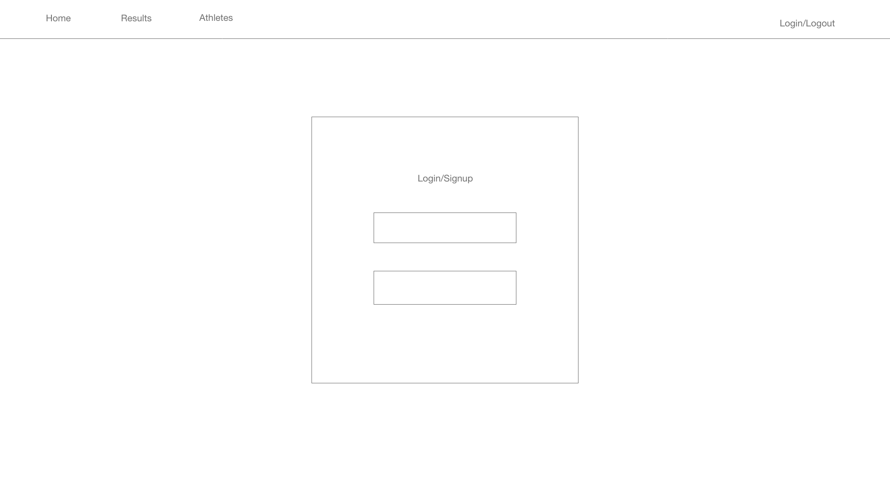
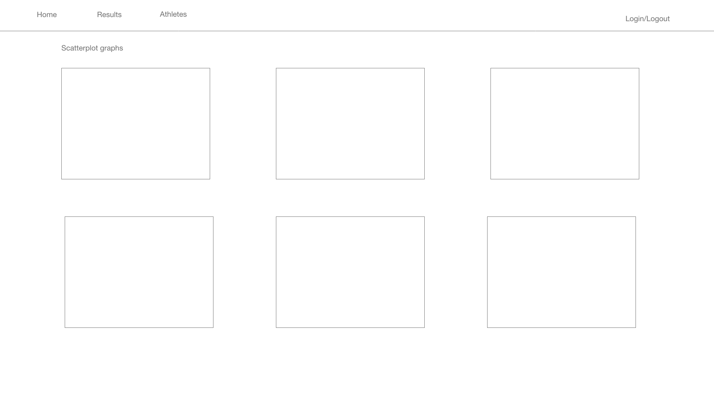
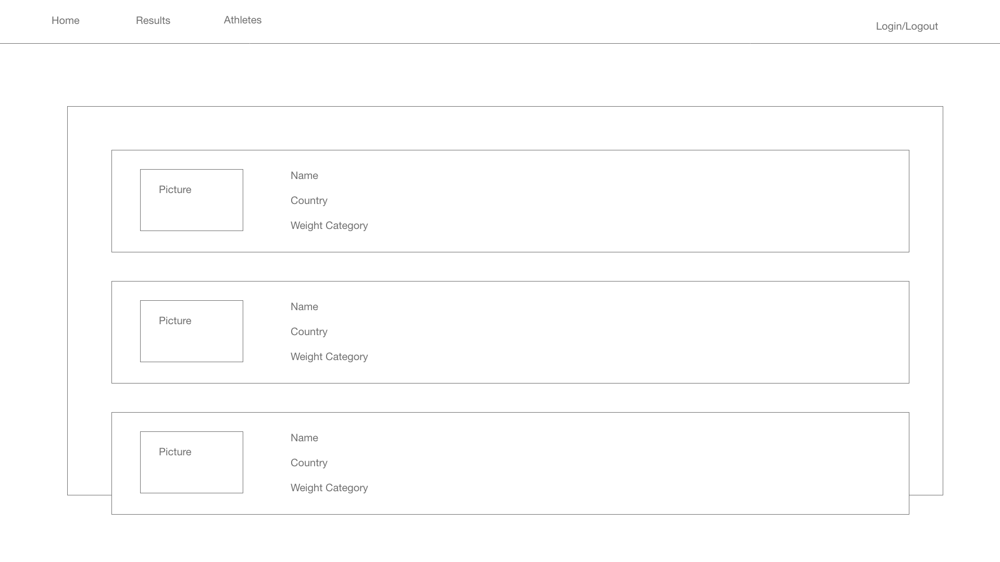

# DEVELOPMENT BRANCH

# Twler

## Tools
- d3.js
- tailwind css
- headless ui

## Wireframes

### As a user, I can:

- Signup
- Log into and out from the site
- Bookmark a competition result
- See a list of all results
- see a list of all athletes

### `npm start`

Runs the app in the development mode.\
Open [http://localhost:3000](http://localhost:3000) to view it in your browser.

### `npm test`

### `npm run build`

### `npm run eject`

